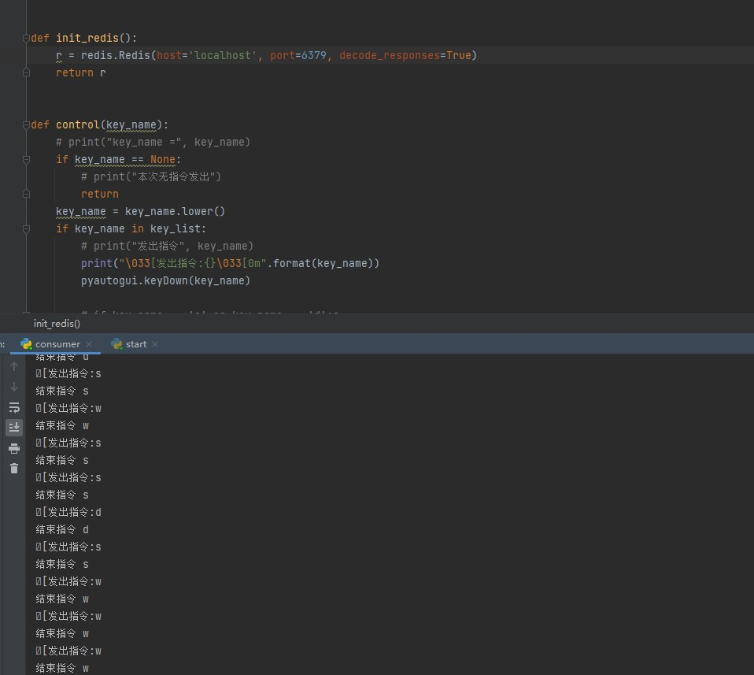
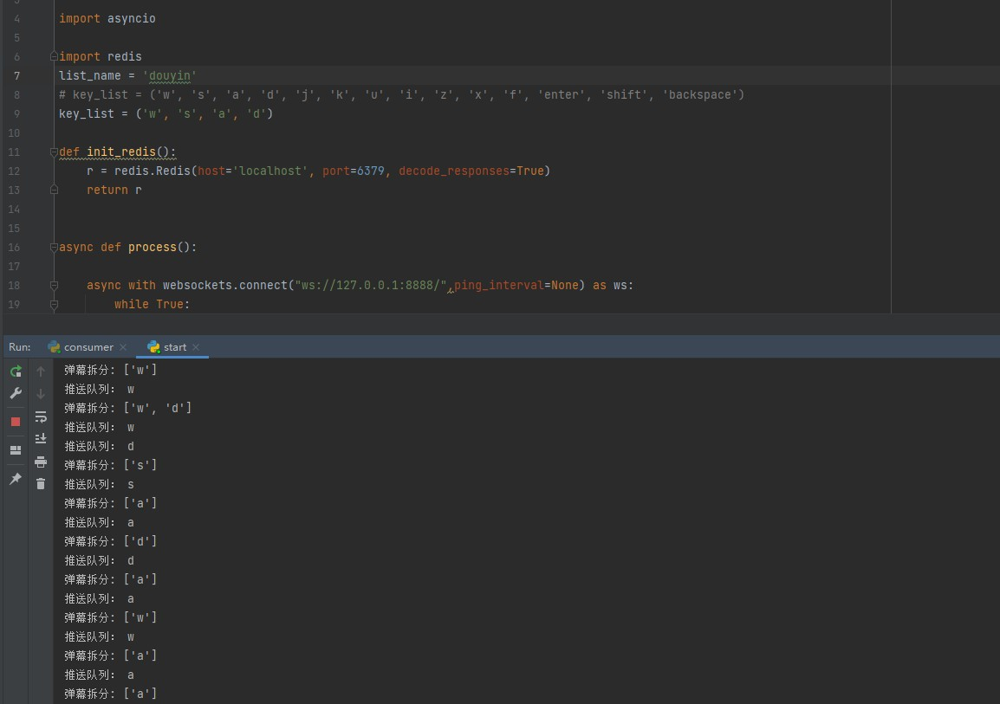
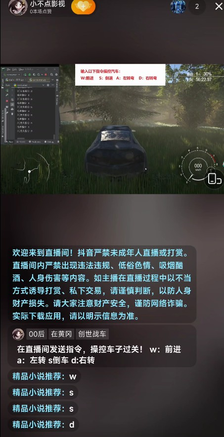

## 一、功能介绍

- 1、实时抓取抖音直播间的弹幕，支持网页端的直播，支持自己用直播伴侣开的直播
- 2、对抓取的弹幕进行筛选，筛选出我们制定的规则弹幕，然后将其写入队列
- 3、对队列里的指定进行读取，并用pyautogui来执行

## 二、使用方法

记得安装依赖哈：pip3 install -r  requirements.txt

启动方法三步走：

- 1、首先打开目录下的WssBarrageService.exe，运行，该程序是抓取抖音弹幕的
- 2、启动  get_message.py   ，来将我们需要的弹幕推进 redis
- 3、运行  consumer.py  ，该脚本会根据上一步推送过来的弹幕，来执行相应的指令

易错点：步骤1，有时候执行完，cmd没抓到弹幕，可以尝试在cmd窗口界面回车几次，或者刷新一下你的抖音直播页面


## 三、遇到的难点

- 1、sockets总是过一会就自动断开连接，导致我这边程序自动停止，百度过好几种方法，最终找到了合适的方法，就是在redis进行连接的时候，添加一个参数。

  - ```python
    async with websockets.connect("ws://127.0.0.1:8888/",ping_interval=None) as ws:  #ping_interval=None 是为了防止sockets断开
    ```

- 2、是原有的抖音弹幕爬虫失效了，但是之前前辈的程序是基于失效的抖音爬虫制作的，所以一些语句的衔接浪费了我一些时间。

## 四、运行效果图及视频








我自己玩的视频：[【弹幕控制直播实现开车】 https://www.bilibili.com/video/BV1dg411H72q/?share_source=copy_web&vd_source=2b548ae9e0a2313a13f5c717a5a8f357](https://www.cnblogs.com/painter-sec/articles/16964353.html)

林亦大佬做的效果视频：[https://www.bilibili.com/video/BV1DB4y1N7QU/?spm_id_from=333.999.0.0&vd_source=c497f3642ad8a5a07f2b3723a25cac05](https://www.cnblogs.com/painter-sec/articles/16964353.html)

蛮三刀酱 大佬的效果视频：[https://www.bilibili.com/video/BV1wg411K7kG/?vd_source=c497f3642ad8a5a07f2b3723a25cac05](https://www.cnblogs.com/painter-sec/articles/16964353.html)


## 五、项目扩展

可尝试该代码和各大直播平台结合，实现无人技术直播，比如 无人生日祝福、无人实现写诗、无人实现点播电影、无人实现ai对答(和openai的ChatGPT想结合，潜力无限)


## 六、鸣谢

我本人仅仅是做了个缝合，之前github上有个类似的，但是抖音的弹幕爬取失效了，所以我重新找了一个，进行了拼合，同时对于相关的一些小细节、错误进行了纠正

蛮三刀酱 前辈代码：https://www.cnblogs.com/rude3knife/p/15635306.html 博客园链接：[https://www.cnblogs.com/rude3knife/](https://www.cnblogs.com/painter-sec/articles/16964353.html)

替换的新的抖音爬虫：https://github.com/HaoDong108/DouyinBarrageGrab

本人github：https://github.com/lishang520


